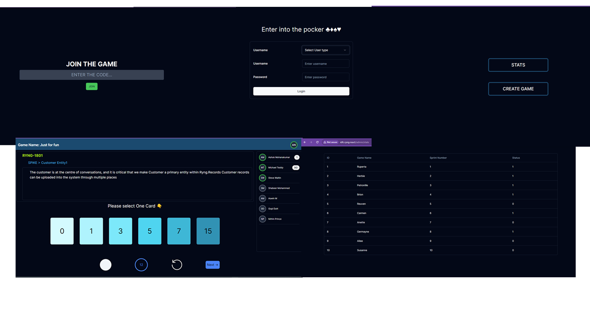

# Story Poker

## Real-Time Collaborative Story Point Estimation Tool

## Overview
A JIRA-integrated tool designed for real-time, collaborative story point estimation. This tool facilitates online team interaction, live point updates, and admin-driven discussions to enhance project planning and streamline the estimation process.

## Features

- Seamless JIRA integration for efficient workflow.
- Real-time collaboration for team interaction.
- Live updates on story point estimations.
- Admin-driven discussions for effective planning.
- User-friendly interface for an intuitive experience.
